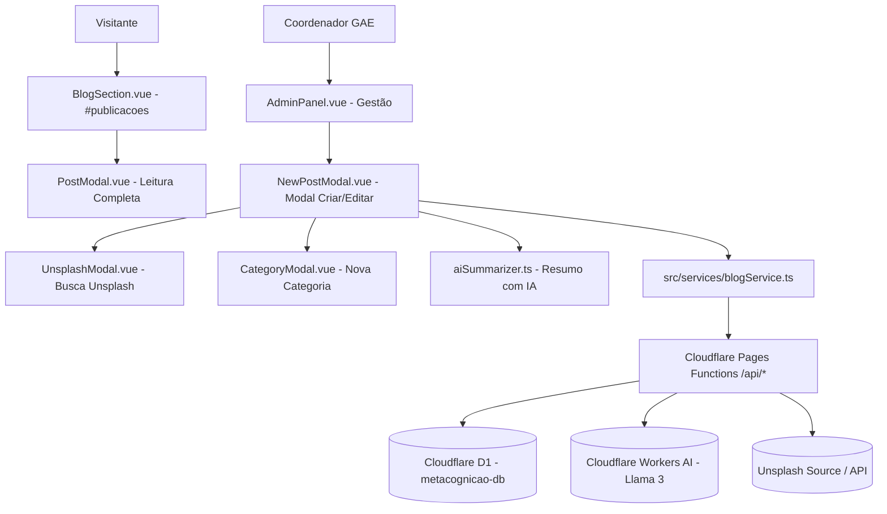

# Arquitetura Técnica - Módulo de Blog & Painel Admin

## 1. Topologia da Solução

## 2. Modelagem do Banco Cloudflare D1 (`metacognicao-db`)
- **Tabela `categories`:**
  - `id` (TEXT PRIMARY KEY)
  - `name` (TEXT NOT NULL UNIQUE)
  - `slug` (TEXT NOT NULL UNIQUE)
  - `created_at` (DATETIME DEFAULT CURRENT_TIMESTAMP)
- **Tabela `posts`:**
  - `id` (TEXT PRIMARY KEY)
  - `title` (TEXT NOT NULL)
  - `slug` (TEXT NOT NULL UNIQUE)
  - `category_id` (TEXT NOT NULL)
  - `category_name` (TEXT NOT NULL)
  - `date` (TEXT NOT NULL) - formato `dd/mm/aaaa`
  - `excerpt` (TEXT NOT NULL)
  - `cover_url` (TEXT)
  - `cover_alt` (TEXT)
  - `content` (TEXT NOT NULL)
  - `created_at` (DATETIME DEFAULT CURRENT_TIMESTAMP)

## 3. Endpoints Serverless (Cloudflare Pages Functions)
- `GET /api/categories`: Retorna lista ordenada de categorias.
- `POST /api/categories`: Cadastra uma nova categoria no D1.
- `GET /api/posts`: Retorna lista de posts públicos ordenados por data decrescente.
- `POST /api/posts`: Cadastra novo post no D1.
- `DELETE /api/posts/:id`: Remove post do D1.
- `POST /api/summarize`: Recebe `{ content: string }`, aciona `env.AI.run('@cf/meta/llama-3-8b-instruct', ...)` e retorna `{ excerpt: string }`.
- `GET /api/unsplash?q=termo`: Retorna fotos livres de direitos com miniaturas, créditos e alt text.

## 4. Otimização Client-Side & Resiliência
- **Compressão de Imagens:** Função `compressImage(file, maxKb=500)` utilizando `<canvas>` e `toBlob('image/jpeg', quality)` para reduzir arquivos pesados no próprio navegador antes do envio.
- **Client Fallback:** `src/services/blogService.ts` detecta se está rodando em ambiente de testes ou offline e serve os dados com resiliência sem quebrar a UI.
