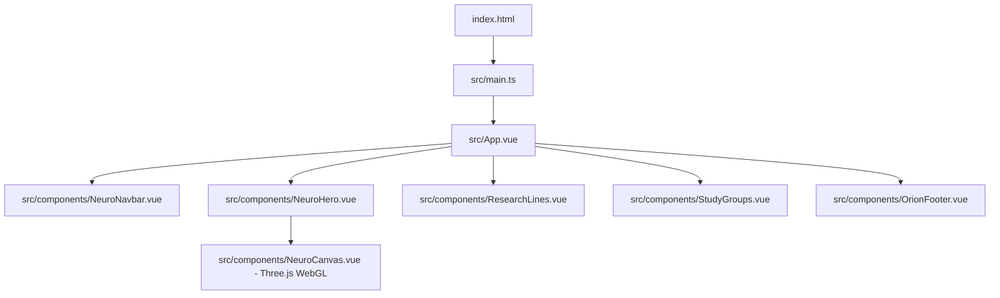

# Arquitetura Técnica - Metacognição

## 1. Visão Geral da Arquitetura
A aplicação é concebida como uma SPA (Single Page Application) baseada em **Vue 3 SFCs**, **TypeScript** e **Vite**, preparada para entrega de altíssima velocidade em Edge Computing (Cloudflare Pages).

## 2. Princípios de Arquitetura e Engenharia
1. **Desacoplamento e Responsabilidade Única (SRP):**
   - O canvas 3D é isolado em um componente dedicado (`NeuroCanvas.vue`), controlando ciclo de vida, resize e destruição de recursos WebGL sem vazar efeitos para o restante da UI.
2. **Ciclo de Vida Eficiente & Eco-friendly Rendering:**
   - O Three.js opera com `requestAnimationFrame` condicional: caso o canvas saia da viewport (detectado por `IntersectionObserver`) ou a aba fique inativa (`document.hidden`), a renderização é pausada, economizando bateria e preservando a responsividade mobile.
3. **Design System & Tailwind CSS:**
   - Paleta corporativa da Metacognição harmonizada com classes utilitárias do Tailwind:
     - `brand-purple`: `#4a148c`
     - `brand-light`: `#7c43bd`
     - `brand-dark`: `#12005e`
     - `brand-accent`: `#ffb300`
     - `brand-teal`: `#00897b`
4. **Resiliência e Cobertura de Testes:**
   - Suíte em Vitest + Vue Test Utils cobrindo montagem, renderização condicional de seções, acessibilidade de links/botões e limpeza segura do WebGL ao desmontar componentes.
